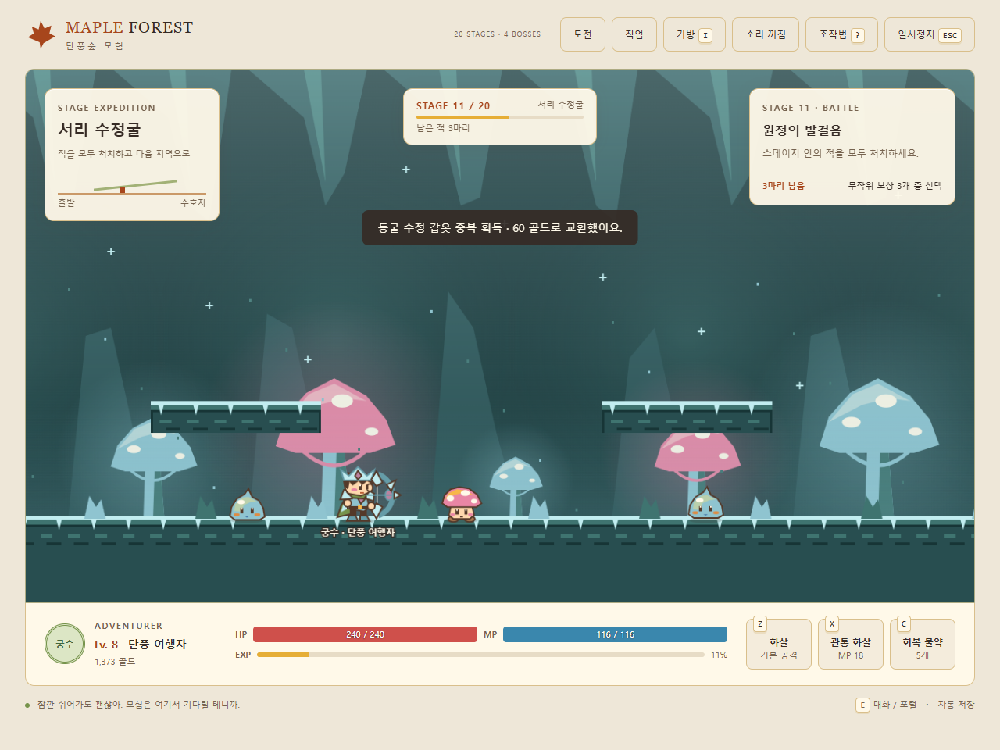
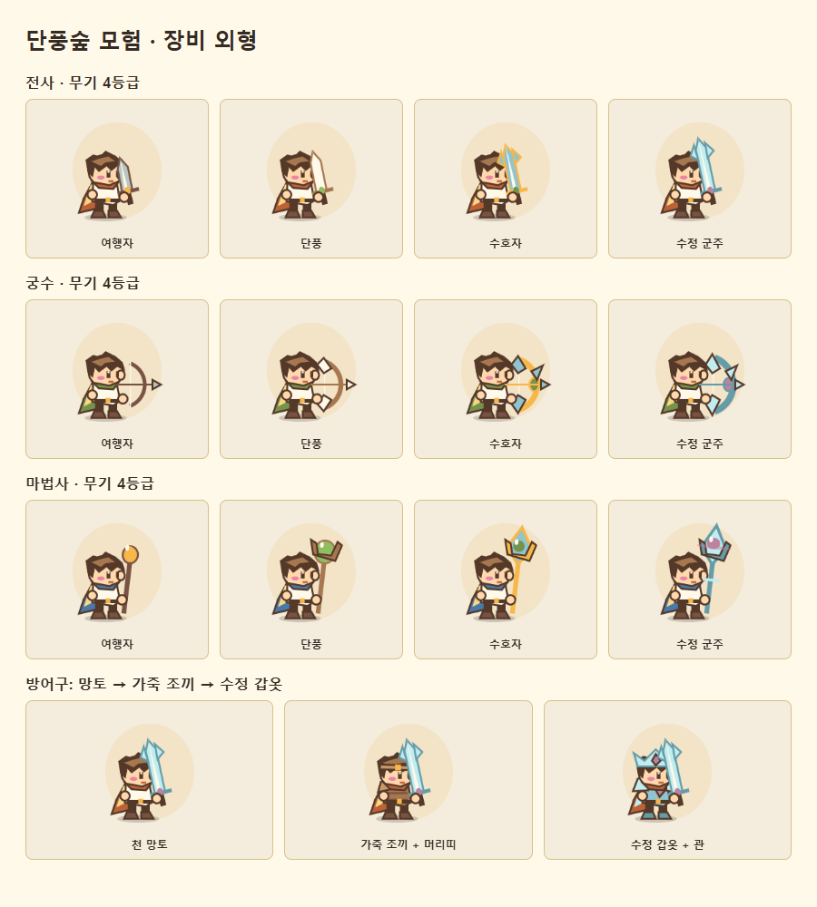

# Maple Forest · 단풍숲 모험

**세 가지 직업으로 탐험하고, 장비를 모으며, 20스테이지 원정에 도전하는 2D 액션 RPG.**

HTML Canvas와 JavaScript로 만든 싱글플레이 웹게임입니다. 설치 없이 브라우저에서 실행하며, 키보드와 모바일 터치 조작을 지원합니다.

> **개발 단계: 플레이 가능한 프로토타입**
> 핵심 전투·성장·저장 흐름을 구현한 초안입니다. 장기 플레이 밸런스와 실물 모바일 기기 검증은 진행할 과제입니다.



## 특징

- **세 가지 직업** — 전사, 궁수, 마법사의 서로 다른 기본 공격과 스킬.
- **자유 탐험** — 단풍숲과 버섯 동굴, NPC 상점, 퀘스트와 두 지역 보스.
- **20스테이지 원정** — 네 가지 지역 테마와 5·10·15·20단계 보스전.
- **선택하며 성장하는 보상** — 스테이지 클리어마다 무작위 보상 세 개 중 하나 선택.
- **장비 수집과 외형 변화** — 직업별 무기 12종, 공용 방어구 3종, 가방과 외형 미리보기.
- **자동 저장** — 캐릭터 성장, 장비, 탐험 기록, 진행 중인 원정과 보상 선택 상태 저장.
- **모바일 조작** — 고정 이동·공격 버튼과 HP/MP 표시, 물약 사용.

## 바로 실행하기

### PC에서 플레이

저장소를 내려받아 압축을 풀고 **`index.html`을 Chrome 또는 Edge로 열면 됩니다.**

Windows에서는 `게임 시작.cmd`를 더블클릭해도 됩니다. 이 방식에는 Node.js, 패키지 설치, 빌드 과정이 필요 없습니다.

### 휴대폰에서 플레이

PC에 Node.js가 설치되어 있다면 프로젝트 폴더에서 실행합니다.

```sh
node mobile-server.cjs
```

Windows에서는 `모바일 실행.cmd`를 사용할 수 있습니다.

1. PC와 휴대폰을 같은 공유기 네트워크에 연결합니다.
2. 콘솔에 표시된 주소를 휴대폰 브라우저에서 엽니다.
3. 화면 아래 터치 버튼으로 플레이합니다.

로컬 서버는 **8765 포트**에서 게임 파일을 제공합니다. 이 방식은 PC와 서버가 실행 중이어야 합니다. 접속이 안 되면 네트워크 연결과 방화벽 허용 여부를 확인하세요. 공개 정적 호스팅에 배포하면 PC 없이 접속할 수 있습니다.

## 조작법

| 입력 | 동작 |
| --- | --- |
| `←` / `→` 또는 `A` / `D` | 이동 |
| `Space` / `↑` / `W` | 점프 |
| `Z` 길게 누르기 | 직업별 기본 공격 |
| `X` | 직업별 스킬 |
| `C` | 물약 사용, HP 최대 80 회복 |
| `E` | NPC 대화, 포털 이용, 원정 메뉴·보상 열기 |
| `I` | 가방 열기, 장비 장착 |
| `Esc` | 일시정지 또는 열린 창 닫기 |

효과음은 상단 소리 버튼으로 켤 수 있습니다. 모바일에서는 하단 터치 버튼을 사용합니다.

## 직업과 장비

| 직업 | 기본 공격 | 스킬 | 마나 / 재사용 대기 |
| --- | --- | --- | --- |
| 전사 | 근접 검격 | 넓은 범위의 바람 베기 | 15 / 1.6초 |
| 궁수 | 날아가는 화살 | 적 최대 3마리를 관통하는 화살 | 18 / 2초 |
| 마법사 | 마력탄 | 주변 적을 공격하는 별빛 폭발 | 22 / 2.4초 |

자유 탐험 중에는 시작 지점의 **숲지기 루미** 근처에서 직업을 변경할 수 있습니다. 레벨과 수집한 장비는 유지됩니다. 원정 진행 중에는 직업을 바꿀 수 없으며, 중단한 원정을 재개하면 해당 원정의 직업으로 돌아갑니다.

장비는 가방에서 장착해야 능력치와 외형에 적용됩니다. 무기는 등급에 따라 형태·재질·장식이 달라지고, 방어구는 망토, 가죽 조끼·머리띠, 수정 갑옷·관으로 구분됩니다.



## 두 가지 플레이 모드

### 자유 탐험

1. 루미에게 무료 회복이나 물약 구입을 할 수 있습니다.
2. 숲 몬스터 8마리를 처치한 뒤 숲의 수호자에게 도전합니다.
3. 오른쪽 포털을 통해 버섯 동굴로 이동합니다.
4. 동굴 몬스터 6마리를 처치한 뒤 버섯 군주를 물리칩니다.
5. 동굴 오른쪽 출구에서 엔딩을 확인합니다. 이후에도 탐험할 수 있습니다.

일반 몬스터 3마리마다 장비를 획득하며, 6마리째에는 방어구가 나옵니다. 지역 보스는 현재 직업의 상위 무기를 제공합니다. 중복 장비는 골드로 전환됩니다.

### 스테이지 원정

시작 화면의 **20스테이지 도전** 또는 상단 **도전** 버튼으로 시작합니다.

| 스테이지 | 지역 테마 | 보스 |
| --- | --- | --- |
| 1–5 | 단풍숲 원정 | 5단계 |
| 6–10 | 빛나는 동굴 | 10단계 |
| 11–15 | 서리 수정굴 | 15단계 |
| 16–20 | 황혼의 숲 | 20단계 |

스테이지의 적을 모두 처치하면 **장비, 회복·물약, 임시 능력 강화**로 구성된 보상 세 개 중 하나를 선택합니다. 선택지는 원정 시드에 따라 정해지고 저장되므로, 새로고침해도 다시 뽑히지 않습니다.

- 획득한 **장비·골드·경험치는 유지**됩니다.
- 원정의 **임시 강화는 새 도전에서 초기화**됩니다.
- **저장하고 자유 탐험**으로 나간 뒤 **저장된 도전 재개**로 돌아올 수 있습니다.
- 쓰러지면 해당 도전은 종료되며 새 도전은 1단계부터 시작합니다.
- 보상 창을 닫았다면 `E` 또는 상단 도전 버튼으로 다시 열 수 있습니다.

## 저장 방식

브라우저의 `localStorage`를 사용합니다. 별도 로그인이나 데이터베이스는 없습니다.

- 플레이 중 주기적으로 저장하고, 전투·장비 변경·지역 이동·보상 선택 등 주요 상태 변화에서도 저장합니다.
- 자유 탐험은 저장된 지역의 입구에서 이어갑니다.
- 원정은 현재 단계, 적의 체력·처치 상태, 보상 대기 상태를 복원합니다.
- 기존 v1/v2 저장은 v3 형식으로 이전합니다.
- 호환성을 위해 저장 키는 `maple-forest-v1`을 유지합니다.

**저장은 기기·브라우저·접속 주소별로 구분됩니다.** PC와 휴대폰은 동기화되지 않으며, 로컬 주소에서 공개 사이트로 이동해도 기록이 자동으로 옮겨지지 않습니다. 브라우저 데이터 삭제나 저장 차단 시 기록이 유지되지 않을 수 있습니다.

## 기술 구성

- HTML / CSS / JavaScript
- Canvas 2D 기반 캐릭터·배경·장비 렌더링
- 고정 시간 간격의 게임 상태 갱신과 `requestAnimationFrame` 렌더링
- Web Audio API 효과음
- `localStorage` 저장 및 이전 버전 데이터 복원
- 선택적으로 실행하는 Node.js 정적 파일 서버

게임 실행을 위한 외부 프레임워크나 런타임 패키지 의존성은 없습니다. 스크립트는 HTML에서 순서대로 불러옵니다.

## 프로젝트 구조

```text
MapleForest/
├── index.html           # 게임 진입점과 화면 구조
├── style.css            # PC·모바일 레이아웃
├── engine.js            # 물리, 몬스터, 충돌, 전투
├── systems.js           # 직업, 장비, 공격, 저장
├── stages.js            # 원정 진행, 보상, 상태 복원
├── render.js            # 카메라와 프레임 렌더링
├── art.js               # 기본 캐릭터·몬스터·사물
├── scenery.js           # 단풍숲 배경
├── expansion-art.js     # 동굴, 투사체, 스킬 효과
├── gear-art.js          # 장비 외형과 미리보기
├── stage-art.js         # 원정 지역 표현
├── menus.js             # 가방, 직업, 상점, 도움말
├── ui.js                # 입력, HUD, 자동 저장 연결
├── stage-ui.js          # 원정 메뉴, 보상 선택, 기록
├── mobile-server.cjs    # 로컬 네트워크 플레이 서버
├── docs/images/         # README 스크린샷
├── DESIGN.md            # 시각 디자인 기준
└── 검증.md              # 구현 검증 기록
```

파일을 편집하고 브라우저를 새로고침하면 변경 내용을 확인할 수 있습니다. 새 게임 파일을 추가할 때는 `index.html`의 로드 순서와 로컬 서버의 허용 파일 목록도 확인하세요.

## 검증과 현재 한계

실제 Chrome 자동화에서 키보드 전투, 모바일 터치, 장비 장착, 저장 복원, 원정 완료·실패·재개를 확인했습니다. 엔진 상태 테스트 18개와 PC·모바일 화면 검토를 수행했습니다. 자세한 범위는 [검증 기록](검증.md)에 정리했습니다.

- 20단계 전체 순회 검증에는 빠른 상태 준비와 피해량 설정을 사용했습니다. 자연스러운 플레이 시간이나 난이도 균형을 검증했다는 의미는 아닙니다.
- 실물 휴대폰과 Safari에서는 추가 검증이 필요합니다.
- 네 가지 원정 테마는 기존 숲·동굴 그래픽을 확장한 구성입니다.
- 계정, 클라우드 저장, 멀티플레이, 온라인 순위표는 구현하지 않았습니다.
- 자동화 검사 도구는 현재 개발 작업 환경에 있으며, 이 저장소의 실행 명령으로 제공하지 않습니다.

## 다음 개발 후보

아래 항목은 구현된 기능이 아니라 후속 작업 후보입니다.

- [ ] 실제 플레이를 통한 직업별 난이도·보상 밸런스 조정
- [ ] 보스 패턴, 일반 몬스터와 스테이지 구성 다양화
- [ ] 장비 비교, 정렬과 수집 도감
- [ ] 저장 파일 내보내기·가져오기
- [ ] 실물 모바일·Safari 테스트와 화면 개선
- [ ] 배경음악과 전투 연출 보강
- [ ] 재실행 가능한 자동화 테스트를 저장소에 정리

## 프로젝트 배경

메이플스토리의 횡스크롤 모험과 PokéRogue의 연속 전투·보상 선택 흐름에서 영감을 받았습니다. 게임의 캐릭터·배경·장비 그래픽은 프로젝트 코드에서 직접 그립니다.

공식 메이플스토리 또는 PokéRogue 프로젝트가 아니며, 원작의 계정·서버·게임 에셋을 사용하지 않습니다.
# maple-forest

